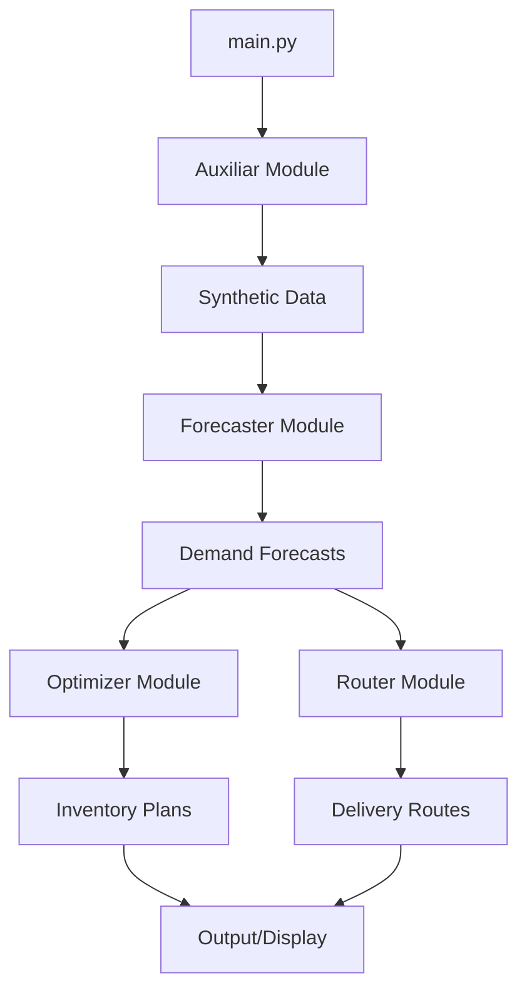

# Design Document

## Overview

SC Labs is a modular supply chain optimization system built in Python that demonstrates end-to-end capabilities for demand forecasting, inventory management, and delivery routing. The system uses GluonTS for time series forecasting, implements classic inventory control policies (reorder point/safety stock), and provides basic route optimization for delivery planning.

The architecture follows object-oriented principles with clear separation of concerns, making each module independently testable and extensible. The system operates on synthetic data but is designed to accept real-world data with minimal modifications.

## Architecture

### High-Level Architecture



### Module Dependencies

- **Auxiliar**: No dependencies on other modules (data generator)
- **Forecaster**: Depends on pandas, numpy, GluonTS
- **Optimizer**: Depends on pandas, numpy, scipy (for statistical functions)
- **Router**: Depends on pandas, numpy, optionally geopy/OR-Tools for distance calculations
- **Main**: Orchestrates all modules

### Data Flow

1. **Auxiliar** generates synthetic dataset with columns: `[store, product, date, sales, inventory, customer_id, destination]`
2. **Forecaster** consumes historical data and produces: `[store, product, date, sales, sample, prediction]`
3. **Optimizer** takes forecasts and produces: `[store, product, date, sample, prediction, safety_stock, reorder_point, inventory, order, shipment]`
4. **Router** takes forecasts and produces two outputs:
   - Delivery data: `[store, product, date, sales, truck, customer, destination, units]`
   - Route summary: `[truck, route_order, origin, destinations, total_distance]`

## Components and Interfaces

### 1. Forecaster Module

**Location**: `forecaster/forecaster.py`

**Class Definition**:
```python
class Forecaster:
    def __init__(
        self,
        primary_keys: List[str],
        date_col: str = 'date',
        target_col: str = 'sales',
        frequency: str = 'W',
        forecast_horizon: int = 4
    )
```

**Key Attributes**:
- `primary_keys`: Grouping columns (e.g., ['store', 'product'])
- `date_col`: Temporal column name
- `target_col`: Variable to forecast
- `frequency`: Pandas frequency string ('W' for weekly, 'D' for daily)
- `forecast_horizon`: Number of periods to forecast
- `model`: Trained GluonTS estimator instance

**Methods**:

1. **prepare_data(df: pd.DataFrame) -> pd.DataFrame**
   - Aggregates data by primary_keys and date
   - Ensures continuous date range using `pd.date_range()`
   - Fills missing values with forward fill or interpolation
   - Returns cleaned DataFrame

2. **fit(df: pd.DataFrame) -> None**
   - Converts DataFrame to GluonTS PandasDataset format
   - Groups by primary_keys to create multiple time series
   - Initializes SimpleFeedForwardEstimator with:
     - `prediction_length=forecast_horizon`
     - `freq=frequency`
     - `trainer=Trainer(epochs=10, learning_rate=1e-3)`
   - Trains model and stores in `self.model`

3. **predict(df: pd.DataFrame) -> pd.DataFrame**
   - Uses trained model to generate forecasts
   - Creates predictions for each primary_key combination
   - Combines historical data (sample='train') with forecasts (sample='test')
   - Returns DataFrame with prediction column (NaN for historical, values for forecast)

**Design Decisions**:
- Use SimpleFeedForwardEstimator for simplicity and speed (suitable for PoC)
- Keep training epochs low (10) for quick demonstration
- Support multiple time series through primary_keys grouping
- Return unified DataFrame format for easy downstream consumption

### 2. Optimizer Module

**Location**: `optimizer/optimizer.py`

**Class Definition**:
```python
class Optimizer:
    def __init__(
        self,
        primary_keys: List[str],
        date_col: str = 'date',
        target_col: str = 'sales',
        inv_col: str = 'inventory',
        planning_horizon: int = 8,
        service_level: float = 0.95,
        review_period: int = 1,
        lead_time: int = 2
    )
```

**Key Attributes**:
- `primary_keys`: Grouping columns
- `planning_horizon`: Number of periods to simulate
- `service_level`: Target service level (e.g., 0.95 = 95%)
- `review_period`: Frequency of inventory reviews (1 = every period)
- `lead_time`: Periods between order placement and receipt

**Methods**:

1. **calculate_safety_stock(demand_series: pd.Series) -> float**
   - Computes standard deviation of demand
   - Calculates z-score from service_level using `scipy.stats.norm.ppf()`
   - Returns: `z_score * std_dev * sqrt(lead_time)`

2. **calculate_reorder_point(avg_demand: float, safety_stock: float) -> float**
   - Returns: `(avg_demand * lead_time) + safety_stock`

3. **simulate(df: pd.DataFrame) -> pd.DataFrame**
   - Groups data by primary_keys
   - For each group:
     - Calculates safety stock and reorder point
     - Initializes inventory from `inv_col`
     - Iterates through planning_horizon periods:
       - Deducts forecasted demand from inventory
       - Checks if inventory < reorder_point (on review periods)
       - Places order if needed (order quantity = reorder_point - current_inventory)
       - Tracks orders in queue with lead_time counter
       - Adds shipments when orders arrive
     - Records inventory, orders, shipments per period
   - Returns consolidated DataFrame with all simulation results

**Design Decisions**:
- Implement (s, S) inventory policy variant (reorder point system)
- Use normal distribution assumption for safety stock calculation
- Support periodic review (not just continuous)
- Track orders in flight to simulate lead time realistically
- Keep simulation logic simple and transparent for educational purposes

### 3. Router Module

**Location**: `router/router.py`

**Class Definition**:
```python
class Router:
    def __init__(
        self,
        primary_keys: List[str],
        date_col: str = 'date',
        target_col: str = 'sales',
        max_payload: int = 10,
        origin: str = '08020'
    )
```

**Key Attributes**:
- `primary_keys`: Grouping columns
- `max_payload`: Maximum units per truck
- `origin`: Starting postal code for all routes
- `customers_db`: Generated customer database

**Methods**:

1. **generate_customers(n_customers: int = 20) -> pd.DataFrame**
   - Creates customer records with unique IDs
   - Assigns random postal codes (5-digit strings)
   - Returns DataFrame: `[customer_id, destination]`

2. **distribute_demand(df: pd.DataFrame) -> pd.DataFrame**
   - For each (store, product, date) with forecasted sales:
     - Randomly selects customers from customers_db
     - Splits sales quantity evenly across selected customers
     - Creates delivery records with units per customer
   - Returns: `[store, product, date, sales, customer, destination, units]`

3. **assign_trucks(deliveries_df: pd.DataFrame) -> pd.DataFrame**
   - Groups deliveries by date
   - For each date:
     - Sorts deliveries by destination (for locality)
     - Assigns deliveries to trucks sequentially
     - Ensures truck payload ≤ max_payload
     - Creates new truck when capacity exceeded
   - Adds `truck` column (e.g., 'truck_1', 'truck_2')
   - Returns updated deliveries DataFrame

4. **optimize_routes(deliveries_df: pd.DataFrame) -> Tuple[pd.DataFrame, pd.DataFrame]**
   - Groups by truck
   - For each truck:
     - Extracts unique destinations
     - Calculates simple distance heuristic (postal code numeric difference)
     - Orders destinations to minimize total distance (nearest neighbor heuristic)
     - Calculates total route distance
   - Returns:
     - Delivery-level data with route information
     - Route summary: `[truck, route_order, origin, destinations, total_distance]`

**Design Decisions**:
- Use simple postal code-based distance (numeric difference) for PoC
- Implement nearest neighbor heuristic (not optimal but fast and simple)
- Support future enhancement with geopy or OR-Tools for real coordinates
- Keep customer generation random but reproducible with seed
- Prioritize clarity over optimization sophistication

### 4. Auxiliar Module

**Location**: `auxiliar/auxiliar.py`

**Function Definition**:
```python
def generate_data(
    n_stores: int = 3,
    n_products: int = 2,
    n_weeks: int = 52,
    start_date: str = '2024-01-01',
    seed: int = 42
) -> pd.DataFrame
```

**Logic**:
1. Set random seed for reproducibility
2. Create date range using `pd.date_range()` with weekly frequency
3. Generate all combinations of stores and products
4. For each combination:
   - Create base demand level (random between 50-200)
   - Add linear trend component (small positive slope)
   - Add seasonal pattern (sine wave with 13-week period)
   - Add random noise (normal distribution)
   - Ensure non-negative values
5. Assign initial inventory (random between 200-500)
6. Generate random customer IDs and postal codes
7. Combine into single DataFrame

**Output Schema**:
```
[store, product, date, sales, inventory, customer_id, destination]
```

**Design Decisions**:
- Use realistic patterns: trend + seasonality + noise
- Make data reproducible with seed parameter
- Include enough history (52 weeks default) for meaningful forecasting
- Keep generation logic simple and transparent

### 5. Main Orchestration

**Location**: `main.py`

**Workflow**:
```python
def main():
    # 1. Generate synthetic data
    data = generate_data(n_stores=3, n_products=2, n_weeks=52)
    
    # 2. Forecasting
    forecaster = Forecaster(primary_keys=['store', 'product'])
    train_data = data[data['date'] < '2024-10-01']
    forecaster.fit(train_data)
    forecasts = forecaster.predict(data)
    
    # 3. Inventory optimization
    optimizer = Optimizer(primary_keys=['store', 'product'])
    inventory_plan = optimizer.simulate(forecasts)
    
    # 4. Route optimization
    router = Router(primary_keys=['store', 'product'])
    deliveries, routes = router.optimize_routes(
        router.assign_trucks(
            router.distribute_demand(forecasts)
        )
    )
    
    # 5. Display results
    print_summary(forecasts, inventory_plan, deliveries, routes)
    
    # 6. Optional: Save outputs
    save_outputs(forecasts, inventory_plan, deliveries, routes)
```

**Design Decisions**:
- Keep main script simple and linear
- Use method chaining where appropriate for clarity
- Separate display and save logic into helper functions
- Make output saving optional
- Include basic error handling for robustness

## Data Models

### Core Data Structures

**1. Historical/Training Data**
```
store: str (e.g., 'A', 'B', 'C')
product: str (e.g., 'X', 'Y')
date: datetime64
sales: float (units sold)
inventory: float (current stock)
customer_id: str (optional)
destination: str (postal code)
```

**2. Forecast Data**
```
store: str
product: str
date: datetime64
sales: float (historical actuals)
sample: str ('train' or 'test')
prediction: float (NaN for train, forecast for test)
```

**3. Inventory Simulation Data**
```
store: str
product: str
date: datetime64
sample: str
prediction: float
safety_stock: float
reorder_point: float
inventory: float (end-of-period)
order: float (quantity ordered)
shipment: float (quantity received)
```

**4. Delivery Data**
```
store: str
product: str
date: datetime64
sales: float
truck: str (e.g., 'truck_1')
customer: str
destination: str (postal code)
units: float
```

**5. Route Summary Data**
```
truck: str
route_order: int (stop sequence)
origin: str (postal code)
destinations: str (comma-separated)
total_distance: float (arbitrary units)
```

## Error Handling

### Forecaster Module
- **Missing data**: Fill gaps with forward fill or interpolation
- **Insufficient history**: Warn if less than 2x forecast_horizon periods
- **Training failure**: Catch GluonTS exceptions and provide meaningful error messages
- **Invalid frequency**: Validate frequency string against pandas standards

### Optimizer Module
- **Negative inventory**: Allow but flag as stockout situation
- **Invalid service level**: Validate range (0.5 to 0.999)
- **Zero demand variance**: Use minimum safety stock when variance is zero
- **Lead time > planning horizon**: Warn user about incomplete simulation

### Router Module
- **Insufficient customers**: Generate additional customers if needed
- **Zero sales**: Skip routing for zero-demand periods
- **Invalid postal codes**: Use placeholder or generate valid format
- **Payload violations**: Ensure strict enforcement of max_payload

### Auxiliar Module
- **Invalid parameters**: Validate n_stores, n_products, n_weeks > 0
- **Invalid date format**: Parse and validate start_date
- **Memory constraints**: Warn if requested data size is very large

### General Error Handling Strategy
- Use try-except blocks for external library calls
- Validate inputs at module boundaries
- Provide informative error messages with context
- Log warnings for non-critical issues
- Fail gracefully with partial results when possible

## Testing Strategy

### Unit Testing Approach

**1. Forecaster Tests**
- Test `prepare_data()` with missing dates
- Test `prepare_data()` with duplicate entries
- Test `fit()` with minimal valid dataset
- Test `predict()` output schema and dimensions
- Test handling of single time series vs. multiple

**2. Optimizer Tests**
- Test safety stock calculation with known variance
- Test reorder point calculation
- Test simulation with zero lead time
- Test simulation with various review periods
- Test order placement logic at reorder point
- Test shipment arrival after lead time

**3. Router Tests**
- Test customer generation count and uniqueness
- Test demand distribution sums to original forecast
- Test truck assignment respects max_payload
- Test route optimization reduces distance
- Test handling of single vs. multiple trucks

**4. Auxiliar Tests**
- Test output schema matches specification
- Test data dimensions (rows = n_stores × n_products × n_weeks)
- Test reproducibility with same seed
- Test non-negative sales values
- Test date range continuity

### Integration Testing

**End-to-End Workflow Test**:
1. Generate small synthetic dataset (1 store, 1 product, 20 weeks)
2. Run forecaster and verify output format
3. Feed forecasts to optimizer and verify inventory simulation
4. Feed forecasts to router and verify route generation
5. Validate data flows between modules
6. Check final output completeness

**Data Consistency Tests**:
- Verify primary keys preserved across modules
- Verify date ranges align between modules
- Verify no data loss in transformations
- Verify aggregations sum correctly

### Testing Tools
- **pytest**: Primary testing framework
- **pandas.testing**: DataFrame comparison utilities
- **numpy.testing**: Numerical assertion helpers
- **fixtures**: Shared test data generators

### Test Data Strategy
- Use small, controlled datasets for unit tests
- Create edge case datasets (single row, missing values, etc.)
- Use fixed random seeds for reproducibility
- Keep test execution time under 30 seconds total

## Performance Considerations

### Scalability Targets (PoC Level)
- Support up to 10 stores × 20 products = 200 time series
- Handle up to 104 weeks (2 years) of historical data
- Process forecasting in under 2 minutes
- Complete full pipeline in under 5 minutes

### Optimization Opportunities (Future)
- Vectorize inventory simulation loops
- Parallelize forecasting across time series
- Use more efficient routing algorithms (OR-Tools)
- Implement caching for repeated calculations
- Add progress bars for long-running operations

### Memory Management
- Process data in chunks if dataset exceeds 100MB
- Clear intermediate DataFrames when no longer needed
- Use appropriate dtypes (int32 vs int64, float32 vs float64)

## Dependencies

### Required Packages
```
pandas >= 1.5.0
numpy >= 1.23.0
gluonts >= 0.13.0
mxnet >= 1.9.0 (GluonTS backend)
scipy >= 1.9.0
```

### Optional Packages
```
geopy >= 2.3.0 (for real coordinate distances)
ortools >= 9.5.0 (for advanced routing)
matplotlib >= 3.6.0 (for visualization)
```

### Python Version
- Minimum: Python 3.10
- Recommended: Python 3.11

## Future Enhancements

### Phase 2 Potential Features
1. **Advanced Forecasting**: Support for DeepAR, Transformer models
2. **Real Coordinates**: Integration with geopy for actual distances
3. **Advanced Routing**: OR-Tools VRP solver for optimal routes
4. **Visualization**: Interactive dashboards with Plotly/Streamlit
5. **Multi-echelon**: Support for warehouse-to-store distribution
6. **Constraints**: Capacity constraints, time windows, vehicle types
7. **Optimization**: Multi-objective optimization (cost vs. service level)
8. **Real Data**: Connectors for CSV, databases, APIs

### Extensibility Points
- Abstract base classes for swappable forecasting models
- Plugin architecture for custom routing algorithms
- Configuration file support (YAML/JSON)
- API endpoints for web service deployment
